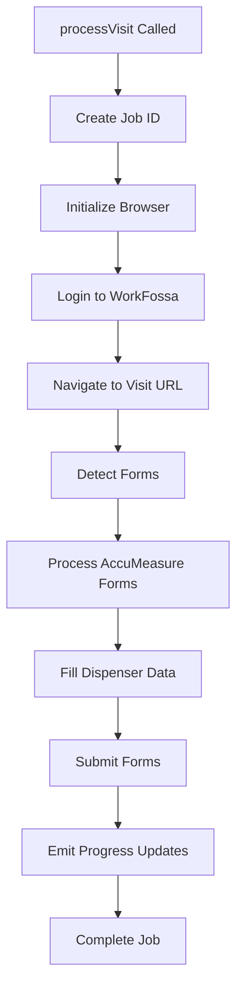

# V1 Form Automation Architecture Analysis

## 📋 EXECUTIVE SUMMARY

The V1 FossaWork system contains a sophisticated browser automation framework built with **Playwright** for automating fuel dispenser form submissions on the WorkFossa platform. The system is complex but well-structured, with clear separation of concerns and comprehensive error handling.

**Key Technologies:**
- **Playwright** for browser automation
- **Node.js/JavaScript** with ES6 modules
- **WebSocket** for real-time progress updates
- **Event-driven architecture** with job management
- **Modular design** with clear separation of concerns

## 🏗️ CORE ARCHITECTURE

### Main Components

1. **AutomateForm.js** - Main orchestrator and entry point
2. **FormProcessor.js** - Core browser interaction and form processing
3. **BatchProcessor.js** - Handles batch processing of multiple visits
4. **accumeasure-form-handler-enhanced.js** - Specialized AccuMeasure form automation
5. **JobManager.js** - Job state and progress tracking
6. **ErrorHandler.js** - Comprehensive error handling and recovery

### Directory Structure
```
V1-Archive/server/form-automation/
├── AutomateForm.js                 # Main orchestrator
├── FormProcessor.js                # Core browser automation 
├── batchProcessor.js               # Batch visit processing
├── accumeasure-form-handler-enhanced.js  # Form-specific handlers
├── JobManager.js                   # Job state management
├── ErrorHandler.js                 # Error handling utilities
├── ErrorRecovery.js                # Error recovery strategies
├── config.js                       # Configuration settings
├── refactoring/                    # Modular refactored components
├── debug/                          # Debug utilities and fixes
└── backup/                         # Historical versions
```

## 🤖 AUTOMATION WORKFLOW

### Single Visit Processing Flow



### Key Methods in AutomateForm.js

```javascript
// Main entry points
async function processVisit(visitUrl, options = {})
async function processBatch(filePath, options = {})

// Status tracking
function getStatus()
function getBatchStatus(jobId = null)

// Job management
const updateStatus = (status, message, progress, dispenserProgress)
```

### Browser Configuration

```javascript
const BROWSER_CONFIG = {
  headless: true,
  args: [
    '--no-sandbox',
    '--disable-setuid-sandbox', 
    '--disable-dev-shm-usage',
    '--disable-web-security',
    '--disable-features=IsolateOrigins,site-per-process'
  ],
  ignoreDefaultArgs: ['--enable-automation'],
  defaultViewport: { width: 1280, height: 800 }
};
```

## 📝 FORM AUTOMATION PATTERNS

### AccuMeasure Form Detection

The system can automatically detect and handle AccuMeasure forms:

```javascript
export async function detectAccuMeasureForms(page) {
  return await page.evaluate(() => {
    // Find AccuMeasure summary button
    const summaryButton = Array.from(document.querySelectorAll('a')).find(a => 
      a.textContent.includes('AccuMeasure') && a.href.includes('accumeasure-summary')
    );
    
    // Find form links
    const formLinks = Array.from(document.querySelectorAll('a[href*="form-entries"]'))
      .filter(a => a.textContent.includes('AccuMeasure'));
    
    // Find create buttons (Attach/New)
    // ... detection logic
  });
}
```

### Form Processing Patterns

1. **Template-based filling** - Uses predefined templates for different fuel configurations
2. **Dynamic dispenser detection** - Automatically identifies dispensers and fuel grades
3. **Progress tracking** - Real-time updates via WebSocket
4. **Error recovery** - Automatic retry and fallback strategies

### Dispenser Automation Logic

```javascript
// Fuel grade configurations (from V1 analysis)
const FUEL_TEMPLATES = {
  REGULAR_PLUS_PREMIUM: ['Regular', 'Plus', 'Premium'],
  REGULAR_PLUS_PREMIUM_DIESEL: ['Regular', 'Plus', 'Premium', 'Diesel'],
  ETHANOL_FREE_VARIANTS: ['Regular', 'Plus', 'Premium', 'Regular-E0']
  // ... more templates
};

// Prover preferences for different scenarios
const PROVER_PREFERENCES = {
  SINGLE_GRADE: 'Preferred prover for single grade',
  MULTI_GRADE: 'Preferred prover for multiple grades',
  DIESEL_SPECIFIC: 'Diesel-specific prover'
};
```

## 🔄 BATCH PROCESSING

### BatchProcessor Architecture

```javascript
export class BatchProcessor {
  constructor() {
    this.activeJobs = new Map();
    this.jobQueue = [];
    this.isProcessing = false;
  }
  
  async processBatch({ filePath, jobId, userId, selectedVisits, resumeFromBatchId }) {
    // Parse visit file
    // Filter selected visits
    // Process sequentially with progress tracking
    // Handle errors and retry logic
    // Save state for resume capability
  }
}
```

### Key Features:
- **Sequential processing** (1 visit at a time for reliability)
- **Resume capability** from failed batches
- **Progress checkpoints** every 5 visits
- **Error recovery** with retry logic
- **Resource management** with memory limits

## 📊 PROGRESS TRACKING & WEBSOCKETS

### Real-time Updates

The system provides comprehensive real-time progress updates:

```javascript
// Progress update structure
const progressUpdate = {
  jobId: finalJobId,
  type: 'phase_started', // or 'fuel_started', 'automation_complete'
  phase: 'login_phase',  // navigation_phase, form_preparation, etc.
  current: 5,
  total: 100,
  percentage: 10,
  message: 'Navigating to visit page...',
  timestamp: new Date().toISOString(),
  dispenser: {
    id: 'dispenser_1',
    title: 'Dispenser 1 - Regular, Plus, Premium',
    fuelGrades: ['Regular', 'Plus', 'Premium']
  }
};

// Emit via WebSocket
emitToUser(userId, 'progress_update', progressUpdate);
```

### Progress Phases:
1. **login_phase** - WorkFossa authentication
2. **navigation_phase** - Navigating to visit page
3. **form_preparation** - Analyzing page and preparing forms
4. **form_filling** - Filling out dispenser forms
5. **completion** - Finalizing and cleanup

## 🛠️ ERROR HANDLING & RECOVERY

### Error Types (from ErrorHandler.js)

```javascript
const ERROR_TYPES = {
  BROWSER_ERROR: 'browser_error',
  NETWORK_ERROR: 'network_error', 
  AUTHENTICATION_ERROR: 'auth_error',
  FORM_ERROR: 'form_error',
  TIMEOUT_ERROR: 'timeout_error',
  VALIDATION_ERROR: 'validation_error'
};
```

### Recovery Strategies

1. **Automatic retry** with exponential backoff
2. **Screenshot capture** on errors for debugging
3. **HTML content saving** for post-mortem analysis
4. **Graceful degradation** - continue processing other visits
5. **State preservation** for manual intervention

### Configuration

```javascript
const batchConfig = {
  delayBetweenVisits: 2000,      // 2 seconds between visits
  retryFailedVisits: true,
  timeoutPerVisit: 300000,       // 5 minutes per visit
  retryConfig: {
    maxAttempts: 3,
    initialDelay: 1000,
    backoffMultiplier: 2
  },
  errorHandling: {
    captureScreenshots: true,
    saveHtmlOnError: true,
    continueOnError: true
  }
};
```

## 🔗 WORKFOSSA INTEGRATION

### Authentication & URLs

```javascript
// V1 discovered these are the correct URLs
const WORKFOSSA_URLS = {
  LOGIN: "https://app.workfossa.com",  // NOT portal.workfossa.com
  DASHBOARD: "https://app.workfossa.com/app/dashboard",
  WORK_ORDERS: "https://app.workfossa.com/app/work/list?visit_scheduled=scheduled..."
};

// Login selectors
const LOGIN_SELECTORS = {
  email: 'input[type="email"][name="email"]',
  password: 'input[type="password"][name="password"]',
  submit: 'button[type="submit"], input[type="submit"]'
};
```

### Form Selectors

The system uses sophisticated selector strategies:

```javascript
const SELECTORS = {
  LOGIN: {
    EMAIL: 'input[type="email"][name="email"]',
    PASSWORD: 'input[type="password"][name="password"]',
    SUBMIT: 'input[type="submit"]'
  },
  FORM: {
    SAVE_BUTTON: 'button:has-text("Save"), button.save, button[type="submit"]',
    SUBMIT_BUTTON: 'button:has-text("Submit"), button.submit, button[type="submit"]',
    CANCEL_BUTTON: 'button:has-text("Cancel"), button.cancel, a:has-text("Cancel")'
  }
};
```

## 🎯 KEY PATTERNS FOR V2 IMPLEMENTATION

### 1. Modular Architecture
- Clear separation between orchestration, processing, and UI
- Pluggable form handlers for different form types
- Centralized configuration management

### 2. Progress Communication
- WebSocket-based real-time updates
- Structured progress messages with phase tracking
- Detailed dispenser-level progress reporting

### 3. Error Handling
- Comprehensive error type classification
- Automatic recovery strategies
- Debug artifact collection (screenshots, HTML)

### 4. Job Management
- Unique job IDs for tracking
- Status persistence for resume capability
- Cancellation support

### 5. Browser Management
- Proper cleanup and resource management
- Configurable headless/headed mode
- Memory and performance optimization

## 🚀 MIGRATION RECOMMENDATIONS

### High Priority for V2
1. **Port core FormProcessor class** to Python/Playwright
2. **Implement progress tracking** with similar WebSocket structure
3. **Create modular form handlers** starting with AccuMeasure
4. **Build job management system** with resume capability
5. **Add comprehensive error handling** with recovery strategies

### Medium Priority
1. **Batch processing** capabilities
2. **Advanced selector strategies** 
3. **Resource optimization** features
4. **Debug and diagnostic** tools

### Configuration Migration
- Port browser configuration settings
- Migrate timeout and retry logic
- Transfer WorkFossa URL and selector mappings

## 📋 TESTING PATTERNS

The V1 system includes comprehensive testing:
- **Real site testing** with actual WorkFossa credentials
- **Page scraping verification** with screenshot capture
- **Selector validation** and form detection testing
- **Error scenario simulation** for recovery testing

---

**Conclusion**: The V1 form automation system is remarkably sophisticated and production-ready. The architecture patterns, error handling, and integration approaches provide an excellent blueprint for implementing similar functionality in the V2 Python/FastAPI system.

---

## 🔍 ADDITIONAL V1 FINDINGS - DETAILED ANALYSIS

### Python AutoFossa Scripts Analysis

**Location**: `/scripts/automation/AutoFossa/`

The V1 system also includes a complete Python automation framework alongside the JavaScript system:

#### Core Python Components

**Definitions.py** - Foundation layer:
```python
# Chrome debugging connection
chrome_options = Options()
chrome_options.debugger_address = "localhost:9222"
driver = webdriver.Chrome(options=chrome_options)

# Common XPath selectors
XPATH_FIELD_3_INPUT = "//div[@id='field-3']//input[@name='field_0']"
XPATH_FIELD_6_INPUT = "//div[@id='field-6']//input[@name='field_0']"
XPATH_FIELD_8_INPUT = "//div[@id='field-8']//input[@name='field_0']"
XPATH_FIELD_9_INPUT = "//div[@id='field-9']//input[@name='field_0']"
```

**Forms.py** - Template system:
```python
def Metered700Form():
    fast()          # Set flow rate
    start()         # Navigate to start
    procedure()     # Select procedure
    wetdown()       # First iteration
    click_following_iteration(driver)
    
    # 5-step metered sequence:
    # 1. Wet Down
    # 2. First Run  
    # 3. Calibration Retest
    # 4. Retest
    # 5. Meter Sealed (slow run)
```

#### Station-Specific Patterns

**Wawa Pattern** (`Wawa_3_Grade_Ethanol_Diesel.py`):
```python
# Pattern: M-B-M-M (Metered-Blend-Metered-Metered)
Metered700Form()  # Regular (metered)
Wawa_Plus_Form1_3Grade_wDiesel_wEthanol()  # Plus (blend/non-metered)
Metered700Form()  # Premium (metered)
Metered700Form()  # Diesel (metered)
```

**Circle K Pattern** (`CK_3_Grade_Diesel_MBMM.py`):
```python
# Uses different form handlers
CK_Metered_Form()  # Regular
CK_Blend_Form()    # Plus (non-metered)
CK_Metered_Form()  # Premium  
CK_Metered_Form()  # Diesel
```

### Fuel Grade Classification Deep Dive

**Location**: `/server/utils/fuelGradeUtils.js`

#### Complex Business Logic

```javascript
function shouldHaveMeter(fuelType, allFuelTypes = []) {
  // ALWAYS METERED
  const typesWithMeters = [
    'Regular', 'Diesel', 'Super', 'Super Premium', 'Ultra',
    'Ethanol-Free Gasoline Plus', 'Ethanol-Free', 
    'Rec Fuel 90', 'Race Fuel'
  ];
  
  // NEVER METERED
  const typesWithoutMeters = [
    'Plus', 'Special 88', 'Extra 89', 'Midgrade 89'
  ];
  
  // CONDITIONAL: Premium
  // Has meter UNLESS Super/Super Premium/Ultra exist
  if (cleanFuelType === 'Premium') {
    const superVariants = ['Super', 'Super Premium', 'Ultra'];
    const hasSuperVariants = allFuelTypes.some(type => 
      superVariants.includes(type.trim())
    );
    return !hasSuperVariants; // No meter if super variants exist
  }
}
```

#### Template System

```javascript
const AUTOMATION_TEMPLATES = {
  GILBARCO_500_700_MECHANICAL: {
    metered: {
      iterations: 5,
      procedures: ['Wet Down', 'First Run', 'Calibration Retest', 'Retest', 'Meter Sealed']
    },
    nonMetered: {
      iterations: 3, 
      procedures: ['Wet Down', 'First Run', 'Retest']
    }
  }
};
```

### Service Code Logic - Critical Business Rules

**From AutomateForm.js analysis**:

```javascript
// Service code detection from work orders
if (service.code === '2861' || service.code === '2862' || service.code === '3002') {
  dispenserCount = parseInt(service.quantity);
}

// Code 2862 = Specific dispensers (parse instructions)
isSpecificDispensers = workOrder.services.some(service => 
  service.code === "2862" || 
  service.description.includes('Specific Dispenser(s)')
);

// Code 3146 = Open Neck Prover (different form type)
const isOpenNeckProver = workOrder.services.some(service => 
  service.code === "3146"
);
```

**Service Code Meanings**:
- **2861**: Standard meter calibration (sequential dispensers)
- **2862**: Specific dispenser calibration (requires instruction parsing)  
- **3002**: Similar to 2861 with quantity-based dispenser count
- **3146**: Open Neck Prover forms (completely different form type)

### Form Detection & Creation Logic

**From accumeasure-form-handler-enhanced.js**:

```javascript
export async function detectAccuMeasureForms(page) {
  return await page.evaluate(() => {
    // Strategy 1: Find existing forms
    const formLinks = Array.from(document.querySelectorAll('a[href*="form-entries"]'))
      .filter(a => a.textContent.includes('AccuMeasure'));
      
    // Strategy 2: Find creation buttons
    const attachButton = /* find Attach button */;
    const newButton = /* find New button */;
    
    return {
      existingFormCount: formLinks.length,
      createButtons: { attachButton, newButton },
      formLinks: formLinks.map(link => ({
        text: link.textContent.trim(),
        href: link.href,
        id: link.href.split('/').pop()
      }))
    };
  });
}
```

### Progress Tracking Architecture

**Real-time updates via WebSocket**:

```javascript
const progressUpdate = {
  jobId: finalJobId,
  type: 'dispenser_started', // phase_started, fuel_started, automation_complete
  phase: 'form_filling',     // login_phase, navigation_phase, form_preparation
  current: 5,
  total: 100, 
  percentage: 10,
  message: 'Processing Dispenser 1 - Regular, Plus, Premium',
  timestamp: new Date().toISOString(),
  dispenserProgress: {
    dispensers: [
      {
        id: 'dispenser_1',
        title: 'Dispenser 1',
        fuelGrades: ['Regular', 'Plus', 'Premium'],
        status: 'processing',
        progress: 45
      }
    ]
  }
};

emitToUser(userId, 'progress_update', progressUpdate);
```

### Batch Processing Deep Dive

**From batchProcessor.js**:

```javascript
export class BatchProcessor {
  async processBatch({ filePath, jobId, userId, selectedVisits, resumeFromBatchId }) {
    // Resume capability
    if (resumeFromBatchId) {
      const previousBatch = jobManager.getJobStatus(resumeFromBatchId);
      const completedVisits = previousBatch.metadata.completedVisitIds;
      
      // Filter out completed visits
      visitsToProcess = allVisits.filter(visit => 
        !completedVisits.includes(visit.id)
      );
    }
    
    // Sequential processing with checkpoints
    for (const visit of visitsToProcess) {
      await this.processVisitInBatch(visit, batchContext);
      
      // Save checkpoint every 5 visits
      if (processedCount % 5 === 0) {
        await this.saveCheckpoint(batchJob);
      }
    }
  }
}
```

### Error Recovery Patterns

**Comprehensive error handling**:

```javascript
const ERROR_TYPES = {
  VALIDATION: 'validation_error',
  AUTHENTICATION: 'authentication_error',
  BROWSER: 'browser_error', 
  FORM: 'form_error',
  NETWORK: 'network_error',
  TIMEOUT: 'timeout_error'
};

// Recovery strategies
const recoveryStrategies = {
  AUTHENTICATION: 'retry_login',
  BROWSER: 'restart_browser',
  FORM: 'reload_page_and_retry',
  NETWORK: 'exponential_backoff',
  TIMEOUT: 'increase_timeout_and_retry'
};
```

### File System Data Structures

**Work Order Format** (from scraped_content.json):
```javascript
{
  "workOrders": [
    {
      "id": "W-123456",
      "services": [
        {
          "type": "Meter Calibration",
          "code": "2861",
          "quantity": "4", 
          "description": "Standard meter calibration service"
        }
      ],
      "instructions": "Test dispensers 1, 3, 5, 7 only"
    }
  ]
}
```

**Visit Processing Context**:
```javascript
{
  "jobId": "job_1672531200000",
  "userId": "user_123", 
  "visitUrl": "https://app.workfossa.com/app/work/123456/visits/789",
  "options": {
    "headless": true,
    "createForms": true,
    "serviceCode": "2861",
    "isSpecificDispensers": false,
    "dispenserCount": 4,
    "instructions": "Standard testing procedure"
  }
}
```

## 🎯 V2 IMPLEMENTATION STRATEGY

### Phase 1: Core Infrastructure
1. **Service Code Detection Engine**
   - Parse work orders for service codes (2861, 2862, 3002, 3146)
   - Extract dispenser counts from service quantities
   - Determine specific vs sequential dispenser strategies

2. **Fuel Grade Classification System**
   - Implement `shouldHaveMeter()` logic for dynamic classification
   - Build automation template system (metered vs non-metered)
   - Handle Premium fuel special case logic

3. **Job Management Framework**
   - Create job tracking with unique IDs
   - Implement status tracking (idle, running, paused, completed, failed)
   - Build resume capability for batch processing

### Phase 2: Browser Automation Core
1. **Playwright Integration**
   - Port browser configuration and initialization
   - Implement login automation for WorkFossa
   - Create page navigation and form detection

2. **Form Processing Engine**
   - Build AccuMeasure form detection and handling
   - Implement iteration templates (3-step vs 5-step)
   - Create dispenser assignment and fuel grade processing

3. **Progress Tracking System**
   - WebSocket real-time updates to frontend
   - Structured progress messages with phase tracking
   - Dispenser-level granular progress reporting

### Phase 3: Advanced Features
1. **Batch Processing**
   - Queue-based batch job processing
   - Checkpoint system for resume capability
   - Error recovery and retry logic

2. **Station-Specific Logic**
   - Template system for Wawa, Circle K, Wayne patterns
   - Custom form field mappings per station type
   - Configurable automation sequences

3. **Error Handling & Recovery**
   - Comprehensive error type classification
   - Automatic recovery strategies
   - Debug artifact collection (screenshots, logs)

### Migration Files Priority

**Critical Files to Port** (Phase 1):
1. `/server/form-automation/AutomateForm.js` - Core orchestration
2. `/server/utils/fuelGradeUtils.js` - Fuel classification logic
3. `/server/form-automation/JobManager.js` - Job tracking

**Important Files to Port** (Phase 2):
1. `/server/form-automation/FormProcessor.js` - Browser automation
2. `/server/form-automation/accumeasure-form-handler-enhanced.js` - Form handling
3. `/server/form-automation/ErrorHandler.js` - Error management

**Advanced Files to Port** (Phase 3):
1. `/server/form-automation/batchProcessor.js` - Batch processing
2. `/server/form-automation/ErrorRecovery.js` - Recovery strategies
3. `/scripts/automation/AutoFossa/` - Python automation patterns

This comprehensive analysis provides the complete blueprint for recreating V1's sophisticated form automation capabilities in V2 while preserving all critical business logic and patterns.